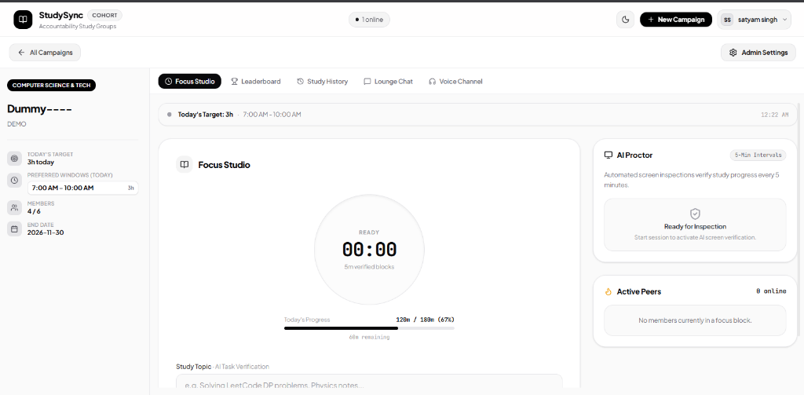
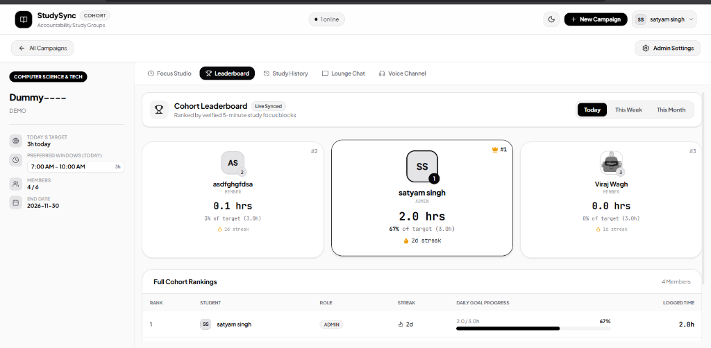
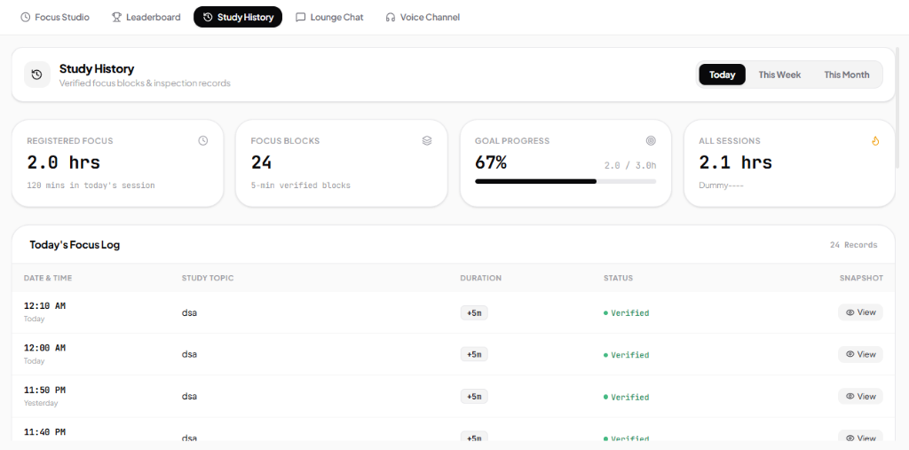
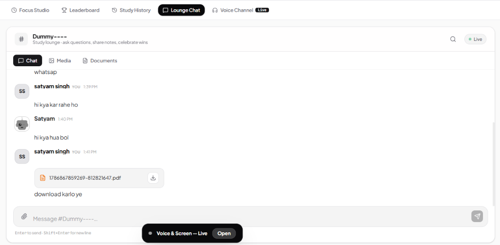
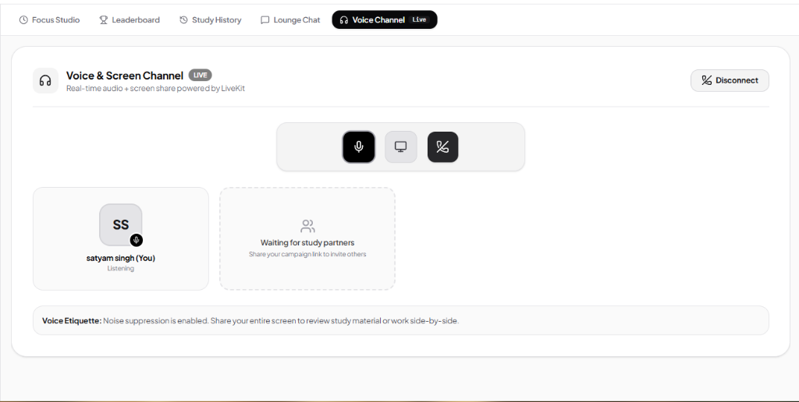

# StudySync

<div align="center">

**Peer Accountability & AI-Proctored Focus Platform for High-Performance Study Cohorts**

[](https://github.com/SATYAM-KS/StudySync)
[](https://123studysync.vercel.app)
[](https://react.dev)
[](https://www.typescriptlang.org)
[](https://tailwindcss.com)
[](https://ai.google.dev/)
[](https://supabase.com)
[](LICENSE)

[Live Demo](https://123studysync.vercel.app) · [Report Bug](https://github.com/SATYAM-KS/StudySync/issues) · [Request Feature](https://github.com/SATYAM-KS/StudySync/issues)

<br/>



</div>

---

## Executive Overview

**StudySync** is a full-stack, real-time peer accountability platform engineered for students, engineers, and competitive exam cohorts who demand genuine deep work. Traditional study timers rely on honor-system self-reporting; StudySync pairs flexible daily study targets with automated **AI Screen Verification powered by Google Gemini Multimodal Vision** to inspect and verify authentic academic productivity in 5-minute blocks.

The platform delivers a minimal, distraction-free monochrome interface packed with real-time WebSockets, WebRTC/LiveKit voice lounges, synchronized group leaderboards, and an instant zero-latency study history ledger.

---

## Platform Showcase & Visuals

### 1. AI Focus Studio & Screen Proctor
> Real-time circular session timer, mandatory custom study topic entry, full-screen monitor verification, and automated 5-minute Gemini AI screen inspections.

<div align="center">
  
</div>

---

### 2. Live Cohort Leaderboard & Streaks
> Real-time cohort rankings computed strictly from verified deep-work blocks. Features a top-3 podium, streak counters, and multi-period filters (Today, This Week, This Month).

<div align="center">
  
</div>

---

### 3. Study History & Focus Log Ledger
> Complete chronological focus block records with 0ms optimistic local updates, daily goal percentages, and visual snapshot inspection verification proofs.

<div align="center">
  
</div>

---

### 4. Cohort Lounge Chat & Document Vault
> Low-latency Socket.IO room messaging with file attachment downloads, reactions, typing status, and smart scroll geometry that preserves position across tabs.

<div align="center">
  
</div>

---

### 5. LiveKit WebRTC Voice & Screen Co-Working
> Instant peer-to-peer audio co-working channels with active acoustic noise suppression, live speaking indicators, and simultaneous screen review.

<div align="center">
  
</div>

---

## Video & Live Interactive Demo

Experience the full interactive workflow on the live deployment:

<div align="center">
  <a href="https://123studysync.vercel.app" target="_blank">
    
  </a>
  <p><em>Click the preview above to try the live application at <a href="https://123studysync.vercel.app">123studysync.vercel.app</a></em></p>
</div>

---

## Key Features

### AI Focus Studio & Screen Proctor
- **Automated Multimodal Inspection**: Analyzes periodic screen snapshots using Google Gemini 2.5/3.6 Flash vision models.
- **Deep-Work Classification**: Distinguishes genuine engineering, programming, and academic coursework (IDEs, terminals, research papers, textbooks, lecture slides) from distraction and timepass (social media, entertainment video streams, gaming).
- **Strict Full-Screen Enforcement**: Requires selection of entire monitors (`displaySurface: 'monitor'`) and rejects single tab or window shares to prevent hidden off-task browser windows.
- **Granular 5-Minute Verified Credit**: Automatically registers verified study time in 5-minute increments with instant UI confirmation and snapshot timeline history.
- **Session Continuity**: Focus timers and active blocks persist seamlessly across browser refreshes and tab re-entries.

### Flexible Cohort Schedules & Daily Targets
- **Custom Daily Goals**: Set daily targets (e.g., 4h/day) with clear progress metrics (`45m / 240m · 19%`).
- **Flexible & Preferred Windows**: Define core cohort study windows while allowing members to study asynchronously anytime throughout the day.
- **Admin Access Gating**: Private cohorts with host review and admission approval workflows.

### Study History & Verified Focus Ledger
- **Multi-Period Aggregations**: Instant filtering by **Today**, **This Week**, and **This Month**.
- **0ms Optimistic Synchronization**: Client-side event bus immediately ingests verified blocks without waiting for network latency or requiring manual page refreshes.
- **Visual Inspection Proof**: Expand and inspect individual verified screen snapshots alongside the AI reasoning and timestamp.

### Real-Time Cohort Leaderboard & Streaks
- **Live Focus Rankings**: Real-time rank calculations driven by verified study blocks.
- **Podium & Metrics**: Top 3 podium display with active daily streak counts and percent-of-goal completion.
- **Timeframe Switching**: Compare standings across daily sprints, weekly goals, or monthly totals.

### Collaborative Study Lounge & Channels
- **Real-Time Group Chat**: Low-latency Socket.IO room messaging with Markdown support, reactions, and typing indicators.
- **Media & Document Repositories**: Filtered views for uploaded study materials, PDF documents, and diagrams.
- **Smart Scroll Geometry**: Preserves message viewport state across tab switches and automatically scrolls to the newest message upon re-entry.
- **LiveKit Voice Lounges**: Crystal-clear, low-latency audio channels for co-working study sessions.

---

## System Architecture

```mermaid
flowchart TD
    subgraph Client["Client (React 18 + Vite + TypeScript)"]
        UI["Monochrome UI / Tailwind CSS"]
        ScreenShare["getDisplayMedia (Full Monitor)"]
        SocketClient["Socket.IO Client"]
        LiveKitClient["LiveKit WebRTC Client"]
        LocalCache["0ms Optimistic State Bus"]
    end

    subgraph Server["Backend API & Real-time Mesh (Node.js + Express)"]
        Express["Express Server / REST API"]
        SocketServer["Socket.IO Server"]
        JWTAuth["JWT Authentication & Guards"]
        CronSync["Background Aggregate Sync"]
    end

    subgraph CloudServices["External Cloud & AI Infrastructure"]
        Gemini["Google Gemini Vision AI API"]
        Supabase["Supabase PostgreSQL (Tables & Auth)"]
        LiveKitCloud["LiveKit Audio Mesh Engine"]
        Vercel["Vercel Edge & Serverless Functions"]
    end

    UI --> LocalCache
    ScreenShare -->|Capture Snapshot (Base64)| Express
    Express -->|Multimodal Prompt| Gemini
    Gemini -->|Classification: Productive vs Off-Task| Express
    Express -->|Insert Verified Block| Supabase
    Express -->|Emit study:block_logged| SocketServer
    SocketServer -->|Real-time Broadcast| SocketClient
    SocketClient --> UI
    UI -->|WebRTC Audio Stream| LiveKitClient
    LiveKitClient <--> LiveKitCloud
```

---

## Tech Stack

| Layer | Technologies |
| :--- | :--- |
| **Frontend Core** | React 18, TypeScript, Vite, HTML5 Canvas, Web Audio API |
| **Styling & Design System** | Tailwind CSS, Lucide Icons, JetBrains Mono, Canvas Confetti |
| **Backend & Runtime** | Node.js, Express, ESBuild, TypeScript |
| **Real-Time Communications** | Socket.IO, LiveKit WebRTC Audio Mesh |
| **AI & Multimodal Vision** | Google Gemini API (`@google/genai` / `@google/generative-ai`) |
| **Database & Persistence** | Supabase (PostgreSQL), Edge SQL Triggers & Indexes |
| **Deployment & Hosting** | Vercel (Production CI/CD), Docker, GitHub Actions |

---

## Project Structure

```text
StudySync/
├── api/                    # Vercel serverless build output
│   └── index.js            # Bundled Node.js backend handler
├── assets/
│   └── screenshots/        # Real application UI screenshots
│       ├── focus_studio.png
│       ├── leaderboard.png
│       ├── lounge_chat.png
│       ├── study_history.png
│       └── voice_channel.png
├── src/
│   ├── components/         # Modular React components
│   │   ├── AdminSettingsModal.tsx  # Cohort member & schedule administration
│   │   ├── AuthScreen.tsx          # Login & registration flows
│   │   ├── CampaignDetail.tsx      # Cohort detail hub with 0ms tab switching
│   │   ├── CampaignsList.tsx       # Discovery dashboard & quick metrics
│   │   ├── ChatRoom.tsx            # Real-time chat, media & document ledger
│   │   ├── CreateCampaignModal.tsx # Cohort creation workflow
│   │   ├── FocusLounge.tsx         # AI Focus Studio & circular timer
│   │   ├── Leaderboard.tsx         # Real-time cohort ranking podium
│   │   ├── Navbar.tsx              # Top navigation & active session indicator
│   │   ├── StudyHistory.tsx        # Chronological focus block log
│   │   ├── UserAvatar.tsx          # Consistent user avatar badge
│   │   └── VoiceRoom.tsx           # LiveKit peer-to-peer audio lounge
│   ├── context/            # React Context providers
│   │   ├── AuthContext.tsx         # JWT token management & session state
│   │   ├── CallContext.tsx         # LiveKit audio call lifecycle
│   │   ├── SocketContext.tsx       # Global Socket.IO event listeners
│   │   ├── StudyContext.tsx        # Screen share capture & AI verification loop
│   │   └── ThemeContext.tsx        # Dark / Light monochrome theme state
│   ├── types/              # TypeScript interface definitions
│   ├── utils/              # Schedule calculations & date formatters
│   ├── App.tsx             # Root component & route guards
│   ├── index.css           # Design tokens, luxury scrollbars & typography
│   └── main.tsx            # Application entrypoint
├── server.ts               # Express backend, REST APIs, Socket.IO & Gemini Proctor
├── supabase_schema.sql     # PostgreSQL database tables, triggers & foreign keys
├── vercel.json             # Vercel serverless routing configuration
├── vite.config.ts          # Vite bundler configuration
└── package.json            # Node.js dependencies & build scripts
```

---

## Getting Started

### Prerequisites
- [Node.js](https://nodejs.org/) (version 18 or later)
- [npm](https://www.npmjs.com/) (version 9 or later)
- [Google AI Studio API Key](https://aistudio.google.com/app/apikey)
- [Supabase Project](https://supabase.com/) (Free Tier PostgreSQL)

### 1. Clone the Repository
```bash
git clone https://github.com/SATYAM-KS/StudySync.git
cd StudySync
```

### 2. Install Dependencies
```bash
npm install
```

### 3. Configure Environment Variables
Create a `.env` file in the root directory:
```env
# Application Port
PORT=3000
NODE_ENV=development

# JWT Authentication
JWT_SECRET=your_super_secret_jwt_key_32_characters_long

# Google Gemini Vision API
GEMINI_API_KEY=your_gemini_api_key_here

# Supabase PostgreSQL Database
SUPABASE_URL=https://your-project-id.supabase.co
SUPABASE_ANON_KEY=your-supabase-anon-key-here

# (Optional) LiveKit Audio Lounge
LIVEKIT_URL=wss://your-project.livekit.cloud
LIVEKIT_API_KEY=your_livekit_api_key
LIVEKIT_API_SECRET=your_livekit_api_secret
```

### 4. Database Setup
1. Navigate to the **SQL Editor** in your [Supabase Dashboard](https://supabase.com/dashboard).
2. Open [`supabase_schema.sql`](supabase_schema.sql) from the repository.
3. Paste the contents into the SQL Editor and execute. This initializes all tables:
   - `users` — Profiles, auth credentials, study targets.
   - `campaigns` — Cohort metadata, daily schedules, target hours.
   - `campaign_members` — Membership roles (`admin`, `co-admin`, `member`, `pending`).
   - `study_blocks` — 5-minute verified focus block records with snapshot URLs and reasoning.
   - `messages` — Room chat history, file attachments, reactions.
   - `active_calls` — Real-time voice room state.

### 5. Launch the Application
```bash
# Start local development server (Frontend + Backend on localhost:3000)
npm run dev
```

Visit **`http://localhost:3000`** in your browser.

---

## API Reference

### Authentication
| Method | Endpoint | Description |
| :--- | :--- | :--- |
| `POST` | `/api/auth/register` | Create a new user account with study goals |
| `POST` | `/api/auth/login` | Authenticate user and issue JWT bearer token |
| `GET` | `/api/auth/me` | Retrieve authenticated user profile |
| `PUT` | `/api/auth/profile` | Update profile details, avatar, and study goal |

### Study & AI Verification
| Method | Endpoint | Description |
| :--- | :--- | :--- |
| `POST` | `/api/study/verify` | Submit screen snapshot for Gemini AI classification & credit |
| `GET` | `/api/study/history` | Retrieve chronological verified study blocks with time aggregations |
| `GET` | `/api/study/leaderboard` | Get real-time cohort rankings (Day / Week / Month) |

### Cohort Campaigns
| Method | Endpoint | Description |
| :--- | :--- | :--- |
| `GET` | `/api/campaigns` | List all available study cohorts |
| `POST` | `/api/campaigns` | Create a new study campaign |
| `GET` | `/api/campaigns/:id` | Fetch specific campaign details and membership status |
| `POST` | `/api/campaigns/:id/join` | Request access to a private study campaign |
| `PUT` | `/api/campaigns/:id/members/:userId` | Approve or reject pending member requests (Admin only) |

### Messages & Lounge
| Method | Endpoint | Description |
| :--- | :--- | :--- |
| `GET` | `/api/messages/campaign/:id` | Fetch message history for a cohort lounge |
| `POST` | `/api/upload` | Upload study document or media screenshot attachment |

---

## Security & Privacy Guarantee

- **Zero-Retention Screen Captures**: Screen frame snapshots sent to the Gemini Vision API are processed strictly in transient memory for classification and are never used for model training.
- **Authenticated Access**: REST and WebSocket endpoints are guarded with cryptographically signed JSON Web Tokens (JWT).
- **Client-Side Monitor Constraint**: Display surface validation prevents background tab leakage and enforces honest monitor sharing.
- **SQL Sanitization**: All database transactions leverage parameterized Supabase PostgreSQL queries preventing SQL injection vulnerabilities.

---

## Contributing

Contributions make the open-source community an exceptional environment for learning, innovating, and building. Any contributions you make are **greatly appreciated**.

1. Fork the Project
2. Create your Feature Branch (`git checkout -b feature/AmazingFeature`)
3. Commit your Changes (`git commit -m 'Add some AmazingFeature'`)
4. Push to the Branch (`git push origin feature/AmazingFeature`)
5. Open a Pull Request

---

## License

Distributed under the **MIT License**. See [`LICENSE`](LICENSE) for more information.

---

<div align="center">
  <sub>Built for students and engineers worldwide. Powered by Google Gemini & Supabase.</sub>
</div>